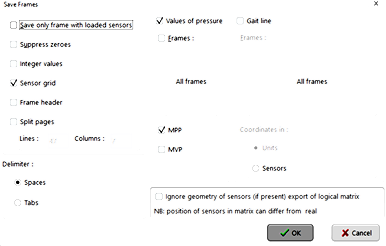
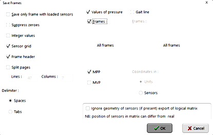

# Plantar Pressure Mapping (PPM) Spatiotemporal Framework

# Description
This spatiotemporal framework alignes maximum pressure pictures (MPP) and sampled pressures over the stance phase of gait (frames) for analysis of plantar pressures at spatial grid locations (sensor-level statistics). This code was built using the Novel EMED sensor platforms and data exporting software. 

# Inputs
On a per participant folder directory organization, .txt files of the raw MPP and stance frames across the entire sensor platform, please see the figure below for how the data was exported using ASCII software. Input .txt files need to be organized with an "_n" at the end for trial number.

MPP:

FRAME:

# Outputs
Raw and aligned MPP and frames are exported to an .xlsx file, along with center of pressure (COP) locations at each frame. Other outputs include MATLAB (.fig) files for each raw and aligned MPP and frame and a gif for each aligned frame combined (see below).

# Running the Analysis
1. Clone or download the repository
2. Open MATLAB
3. Navigate to the repository folder
4. Run: PPM_Stance_Intervals_EMEDxl.m (or just EMED.m if data collection was on the non-xl version).

# Important information
The code is built on the foot progression angle (FPA) for rotation of all trials, this FPA can be exported from data collection software or calculated in the code based upon a previously developed approach (Keijsers NLW, et al., "A new method to normalize plantar pressure measurements for foot size and foot progression angle", 2009.). Resampling of the MPP and frames uses a force preserving approach to align all to a standard grid size - see the resample_force_preserve.m function.

# Authors
Tyce C. Marquez ([LinkedIn](www.linkedin.com/in/tyce-marquez-3b4696194))
University of Iowa

# License
This project is licensed under the MIT License.

# Version History
0.1 Initial Release
